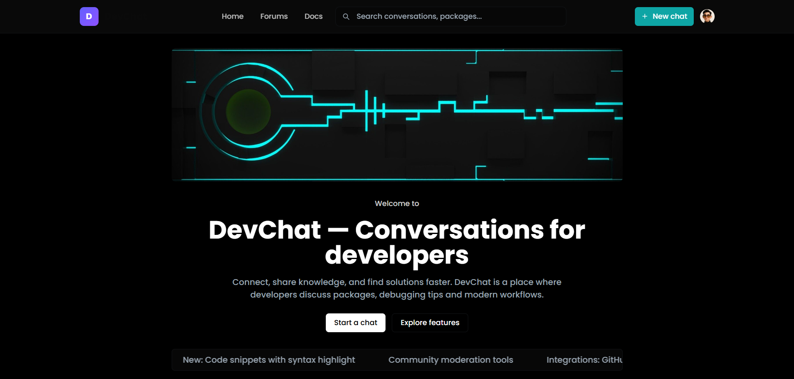

<div align="center">

# DevChat

Real-time developer forum platform with instant messaging

[](https://nextjs.org/)
[](https://tailwindcss.com/)
[](https://getstream.io/chat/)
[](https://clerk.com/)

</div>

---

## Screenshots

<div align="center">




</div>

---

## Tech Stack

**Frontend**

- Next.js 15.5 (App Router)
- React 19
- Tailwind CSS v4
- stream-chat-react
- shadcn-inspired UI components

**Backend & Services**

- Next.js API Routes
- Stream Chat SDK (server-side token generation)
- Clerk Authentication

**Deployment**

- Vercel (recommended)

---

## Features

- Server-signed Stream Chat tokens (secure, no client-side secrets)
- Real-time messaging with Stream Chat React components
- Clerk-powered authentication with social logins
- Dynamic forum routes for topic-based discussions
- Responsive shadcn-style UI with Tailwind CSS
- Server-side user token minting and channel creation

---

## Quick Start

### Prerequisites

- Node.js 18+
- npm or yarn
- Clerk account (free tier available)
- Stream Chat account (free tier available)

### Setup in 7 Steps

```bash
# 1. Clone the repository
git clone https://github.com/DevAgnihotri/Devchat.git && cd Devchat

# 2. Copy environment template and add your keys
cp .env.example .env.local

# 3. Install dependencies
npm install

# 4. Start the development server
npm run dev

# 5. Open browser to http://localhost:3000

# 6. Sign in with Clerk (creates user session)

# 7. Visit /forums and click any forum to test real-time chat
```

---

## Environment Variables

Create `.env.local` in the project root and add:

```env
# Stream Chat
STREAM_API_KEY=your_stream_api_key
STREAM_API_SECRET=your_stream_secret
NEXT_PUBLIC_STREAM_API_KEY=your_stream_public_key

# Clerk Authentication
NEXT_PUBLIC_CLERK_PUBLISHABLE_KEY=your_clerk_publishable_key
NEXT_PUBLIC_CLERK_FRONTEND_API=your_clerk_frontend_api
CLERK_SECRET_KEY=your_clerk_secret_key
```

**Security**: Never commit secrets. Use Vercel environment variables for production.

---

## Project Structure

```
devchat/
├── app/
│   ├── api/create/        # Server route for token generation
│   ├── forum/[slug]/      # Dynamic forum pages
│   ├── forums/            # Forums listing
│   ├── docs/              # Documentation page
│   └── layout.js          # Root layout with ClerkProvider
├── components/
│   ├── ChatForum.js       # Stream Chat UI wrapper
│   ├── Navbar.js          # Navigation with auth UI
│   └── ui/                # shadcn-style components
└── public/
    └── Screenshots/       # App screenshots
```

---

## Architecture

**Authentication Flow**

1. User signs in via Clerk
2. Client requests token from `/api/create`
3. Server mints Stream token using `STREAM_API_SECRET`
4. Server upserts user to Stream and creates channels
5. Token returned to client and stored in Clerk metadata

**Chat Flow**

1. `ChatForum` component checks for user token
2. If missing, auto-requests from `/api/create`
3. Initializes Stream client with token
4. Connects to channel and renders real-time UI

---

## Commands

```bash
npm run dev      # Start development server (Turbopack)
npm run build    # Production build
npm start        # Start production server
```

---

## Deployment

### Deploy to Vercel

1. Push code to GitHub
2. Import project in Vercel dashboard
3. Add environment variables (see above)
4. Deploy

**CLI (alternative)**

```bash
vercel --prod
```

See [VERCEL_DEPLOY.md](./VERCEL_DEPLOY.md) for detailed deployment instructions.

---

## Troubleshooting

**Issue**: `/api/create` returns 500  
**Fix**: Verify `STREAM_API_KEY` and `STREAM_API_SECRET` are set in environment

**Issue**: Chat fails to connect  
**Fix**: Check browser console for token errors; confirm `/api/create` response includes token

**Issue**: Clerk auth errors in production  
**Fix**: Ensure `NEXT_PUBLIC_CLERK_FRONTEND_API` is set in Vercel environment variables

---

## Contributing

Contributions welcome. Open an issue or PR.

---

## License

MIT

---

<div align="center">

Built with Next.js, Stream Chat, and Clerk

[Report Bug](https://github.com/DevAgnihotri/Devchat/issues) · [Request Feature](https://github.com/DevAgnihotri/Devchat/issues)

</div>
